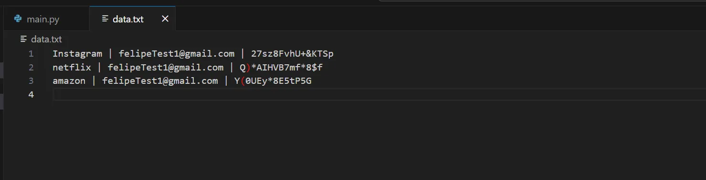
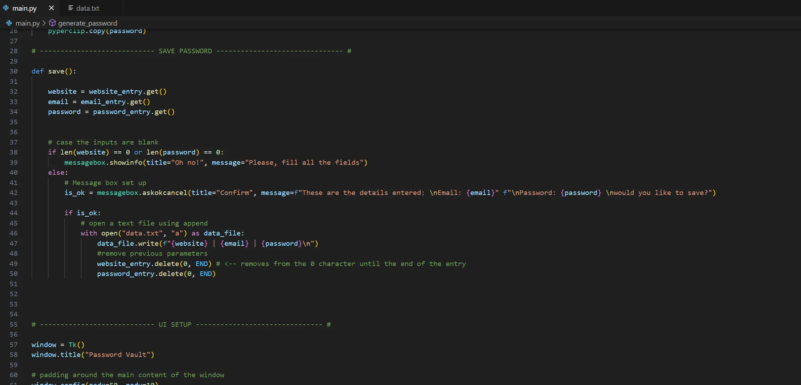

## 📄 Description

🔐 This is a Password Vault program built in Python using the tkinter and pyperclip libraries. Users can add websites, usernames, and passwords. 
Once the 'Add' button is clicked, the information is securely saved to a .txt file, as the program works entirely offline.

Additionally, the program includes a secure password generator. 
The generated password is automatically copied to the clipboard, making it easy for users to paste wherever needed.

The program displays a confirmation message before saving any information. 
If a required input is left blank, an error message will notify the user. 
Once the process is complete, the inputs are automatically cleared, preparing the program for the next use.

* 🚫🤖 No AI code 

## 📷 Screenshots

  

